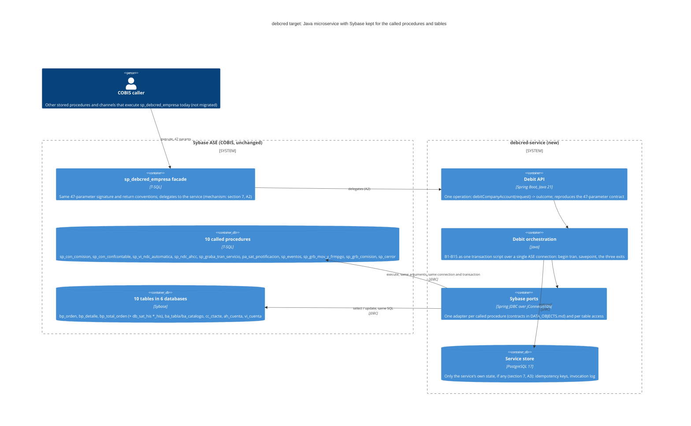
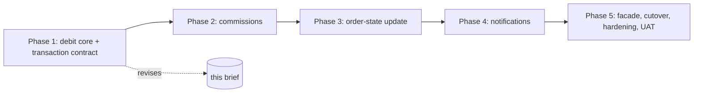

# Modernization Brief: debcred (`dbo.sp_debcred_empresa`)

Generated 2026-09-27 from: `INTENT.md` (11:02), `PREFLIGHT.md` (10:51), `ASSESSMENT.md` (11:02), `topology.json` (11:11), `BUSINESS_RULES.md` / `DATA_OBJECTS.md` (17:05, after the third extraction round: 39 rules; rule ids in this brief were renumbered accordingly), `RULE_REVIEWS.json` (16:23). Target stack: **java-spring** (Java 21, Spring Boot), as INTENT.md decides. No earlier brief existed.

**How to steer this plan:** the approver edits this file. A ticked box, a changed criterion or a note in §7 is honored by every later command; a chat message is not. Build commands may tick a box or add a `Proposed revision:` line, never reword a criterion.

## 1. Objective

Move `dbo.sp_debcred_empresa`, the Sybase ASE / COBIS stored procedure (2,173 lines, 47 parameters) that debits a company's bank account for a payment order, charges its commissions, records the movement, notifies the customer and moves the order header to "in transition", from Transact-SQL into a **Java microservice**, **without changing any business rule** (INTENT.md, 2026-09-27: "se debe mantener la logica actual no cambiar reglas de negocio"). The ten procedures it calls and the ten tables it touches **stay in Sybase** and are still invoked, because they are not migrated yet; the COBIS callers keep working through the procedure's existing signature. Why now: the procedure is the first slice of a Sybase-to-Java program for Banco Bolivariano; its fifteen years of patches (REF2–REF45) and its three different transaction outcomes make it the right place to prove that a technology port can preserve behavior exactly before larger pieces follow. Equivalence is proven against the rules and, where the bank's test ASE allows, against recorded outputs of the original.

## 2. Target Architecture



| Legacy component (topology id) | Target component | Notes |
|---|---|---|
| B0 Signature and declarations | `DebitRequest` record + façade signature | 47 parameters kept, defaults kept (`@i_canal='DIR'`, `@i_tipo_afec='10'`, `@i_aplcobis='N'`); `@o_reg_a_proc` stays in the signature and stays NULL (parity). |
| B1 Init and commission normalization | `CommissionNormalizer` | RULE-027, RULE-002 (integer truncation preserved). |
| B2 Concept resolution | `AccountingConceptResolver` | RULE-029 (`@s_term` carries the SPI concept, then blanked: preserved). |
| B3 Accounting configuration | `AccountingConfigurationPort` → `sp_con_confcontable` | RULE-007, RULE-030; error 120000 before the transaction. |
| B4 begin tran + savepoint | `AseTransaction` (one connection, `begin tran`, `save tran`) | The central design risk (§7 A1). |
| B5 Reference string / special causal | `DebitReferenceBuilder` | RULE-038, RULE-031. |
| B6 Debit note by account type | `DebitNotePort` → `sp_ndc_ahcc` / `sp_vi_ndc_automatica` | RULE-009, RULE-009. |
| B7 Notifications | `NotificationStep` + ports to `pa_sat_pnotificacion`, `sp_eventos`, 8 table reads | RULE-034/030/031/010/019/005/006, RULE-003/004/011; the overwrite of the debit result at `:1248` is preserved. |
| B8 Accounting account (type 9) | `LedgerAccountDebitPort` → `sp_graba_tran_servicio` | RULE-022 (company 1295 preserved). |
| B9 Debit outcome and movement record | `DebitOutcomeStep` + `MovementPort` → `sp_grb_mov_y_frmpgo` | RULE-012, RULE-015, RULE-023, RULE-024: exit A (partial commit). |
| B10 Commission debit | `CommissionStep` + `CommissionPort` → `sp_grb_comision` | RULE-013, RULE-001, RULE-025: exit B (full rollback, then the error movement in autocommit). |
| B11 Second SWIFT commission | `CommissionStep` (second call) | RULE-016. |
| B12 Order-state update | `OrderHeaderRepository` (live table, history fallback) | RULE-014, RULE-018, RULE-010. |
| B13 Commented ROLPAGO update | **not migrated** (dead code) | Listed in §7 A11. |
| B14 Success exit / B15 lbl_error | `DebitOutcome` + `ErrorReportingPort` → `sp_cerror` | RULE-028: return-code convention differs by `@i_aplcobis`. |
| sp:* (10 procedures) | Ports, one adapter each, called through the same ASE connection | Contracts inferred in `DATA_OBJECTS.md`; source not in the tree (§7 A5). |
| ds:* (10 tables) | Same SQL through the ports | No DDL in the tree (§7 A5). PostgreSQL holds none of them (§7 A3). |

## 3. Phased Sequence

Strangler fig, lowest risk first, with one rule that shapes the order: **the transaction contract is proven in Phase 1**, because every later phase depends on it, and because the legacy has three different exits (partial commit, full rollback + autocommit write, full rollback) that a Java service over JDBC must reproduce exactly. Notifications go last: they are the largest and most coupled block (510 lines, 8 tables, 2 procedures) and, per RULE-035, they are a no-op whenever no SMS mapping exists, so Phases 1–3 can run with the notification step returning "not configured".

**Phase 1 is a pilot and this brief is a hypothesis.** What the pilot surfaces (how ASE nested transactions behave through JDBC, whether callers open an outer transaction, what the ten procedures really return) is *expected* to revise this brief; regenerating it after Phase 1 is the normal path. Legacy systems hide their surprises in the runtime, not in the source.



#### Phase 1 — Debit core and the transaction contract (pilot)
Command: /code-modernization:modernize-transform
Modules: B0, B1, B2, B3, B4, B5, B6, B8, B9, B14, B15, sp:sp_con_comision, sp:sp_con_confcontable, sp:sp_ndc_ahcc, sp:sp_vi_ndc_automatica, sp:sp_graba_tran_servicio, sp:sp_grb_mov_y_frmpgo, sp:sp_cerror, ds:cob_virtuales..vi_cuenta, ds:db_biz_admempresa..ba_tabla, ds:db_biz_pagos..bp_orden, ds:db_sat_his..bp_orden_his
Scale: L
Risk: High; (1) the savepoint-scoped rollback of exit A and the full rollback of exit C must behave over one JDBC connection exactly as inside ASE, including when a caller has its own transaction open — mitigation: the pilot's first slice is exactly this path, tested against a real ASE if §7 A4 is answered, else against a contract mock with the semantics written in `DATA_OBJECTS.md` and flagged as assumed; (2) the ten procedures' return codes and side effects are unknown (source not in the tree) — mitigation: §7 A5 before the plan gate, else assumed contracts signed in §7 and the mocks contract-tested so a correction is a one-file change.
Entry criteria:
- [x] This brief is approved (§8) for at least Phase 1. *(2026-09-27, David Balseca, §8: Phase 1 only)*
- [x] §7 A1 (transaction contract), A2 (façade mechanism), A4 (ASE test access) and A8 (home database of unqualified names) are answered. *(2026-09-27: all four answered in §7 by David Balseca; A2 and A8 carry a clarification to settle at this plan gate.)*
- [x] §7 A5: the source, or a signed contract, of `sp_con_confcontable`, `sp_con_comision`, `sp_ndc_ahcc`, `sp_vi_ndc_automatica`, `sp_graba_tran_servicio`, `sp_grb_mov_y_frmpgo` and `sp_cerror` is in `sp-banco-bolivariano/` or recorded in `DATA_OBJECTS.md` as assumed. *(2026-09-27: §7 A5 rules "not available; assumed contracts of DATA_OBJECTS.md accepted, marked as assumed".)*
- [x] First slice named: **account type 3 (current account) through `sp_ndc_ahcc`, happy path and debit failure (exit A)**, before types 4, 12 and 9. *(2026-09-27: named here; confirmed at the Phase 1 plan gate.)*
- [x] `PREFLIGHT.md` Check 3 re-run with `java-spring`: JDK, Maven and a Sybase JDBC driver resolve here. *(2026-09-27: JDK 24 (release 21 target), Maven 3.9.9, Spring Boot 4.1.1 and jTDS 1.3.1 resolved into the local Maven cache; recorded in PREFLIGHT.md 3c.)*
Exit criteria:
- [x] Characterization tests pass for RULE-007, 008, 012, 015, 016, 021, 022, 024, 025, 026, 027, 028, 032 and RULE-002 (with its truncation), each named by rule id. *(2026-09-27, transform Phase 1: 115 tests, 0 failures; TRANSFORMATION_NOTES.md. Proposed revision: the ids of this criterion predate the round-3 renumbering; the tests pin RULE-002, 007, 008, 009, 015, 022, 023, 024, 026, 027, 028, 029, 030, 031, 032, 033, 037, 038, 039.)*
- [x] The three exits are pinned by tests that assert the committed state: exit A (debit failed: savepoint rollback, error movement committed, code returned), exit C (`lbl_error`: full rollback, `sp_cerror` only when `@i_aplcobis='S'`, return code vs `@o_error` per RULE-028). *(2026-09-27: exits A and C pinned on committed state in Rule012Rule015Rule028Rule023ExitsTest and GoldenCasesTest; exit B belongs to Phase 2.)*
- [x] The notification step is a stub that returns "not configured" and is proven to leave `@w_cod_errord` untouched, so Phase 4 can replace it without changing Phases 1–3. *(2026-09-27: NotificationStubTest, 8 tests.)*
- [x] A canary (one deliberate break in the savepoint handling) turns tests red, recorded in `TRANSFORMATION_NOTES.md`. *(2026-09-27: savepoint rollback -> full rollback: 14 red; truncation DOWN -> HALF_UP: 3 red; XML under analysis/debcred/equivalence/canary/sp_debcred_empresa/.)*
- [x] `TRANSFORMATION_NOTES.md` records every fact the pilot learned about ASE transactions through JDBC, and this brief is regenerated or its §8 re-signed for Phases 2+.

#### Phase 2 — Commissions
Command: /code-modernization:modernize-transform
Modules: B10, B11, sp:sp_grb_comision
Scale: M
Risk: High; (1) exit B (commission failed: full `rollback tran`, then `sp_grb_mov_y_frmpgo` written **outside** any transaction, return without commit, `:1622-1700`) is the hardest behavior to reproduce and the one most tempting to "fix" — mitigation: RULE-013 was confirmed as-is by the approver; the test asserts that after exit B the debit is gone, the error movement persists, and the order header is still `I`; (2) `sp_grb_comision` receives the savepoint name (`@i_savepoint`, `:1584`) and may roll back to it inside — mitigation: §7 A5 for its source, else the mock records whether the savepoint was passed.
Entry criteria:
- [x] Phase 1 exit criteria met and the brief re-signed.
- [x] §7 A5 for `sp_grb_comision`. *(2026-09-27: §7 A5 rules "not available; assumed contracts of DATA_OBJECTS.md accepted, marked as assumed"; the CommissionDebitPayload contract in DATA_OBJECTS.md is the assumed one.)*
Exit criteria:
- [x] Characterization tests pass for RULE-013, 017, 001, 023, and exit B is pinned by a test that asserts the final state of debit, movement and header. *(2026-09-27, transform Phase 2: 184 tests, 0 failures; exit B pinned on committed state in Rule013ExitBTest. Proposed revision: the ids predate the round-3 renumbering; the tests pin RULE-013, 016, 017, 001, 025, 039.)*
- [x] The dead remnants `:1716-1730` and `:1844-1854` are listed as not migrated in `TRANSFORMATION_NOTES.md` with a test that shows they are unreachable. *(2026-09-27: listed in TRANSFORMATION_NOTES.md "Phase 2"; no-commit tests in Rule013ExitBTest and Rule016Rule017SecondSwiftCommissionTest.)*

#### Phase 3 — Order-state update
Command: /code-modernization:modernize-transform
Modules: B12, ds:db_biz_pagos..bp_total_orden, ds:db_sat_his..bp_total_orden_his
Scale: S
Risk: Medium; (1) the four near-identical branches (channel × `@i_opcion` × payment forms, `CHL` vs `CHE`) and the live-then-history fallback with `@@rowcount` — mitigation: a property-based test over the branch matrix and a test per fallback; (2) the exempt-service list at `:2080` and the stale `@wRowdbBiz` when `@i_opcion` is outside `01–03` are preserved (parity) — mitigation: pinned by tests named after RULE-010 and RULE-014, with the quirk documented.
Entry criteria:
- [x] Phase 2 exit criteria met. *(2026-09-27: both Phase 2 exit criteria ticked with evidence; TRANSFORMATION_NOTES.md "Phase 2".)*
- [x] §7 A5: DDL of `bp_total_orden` and `bp_total_orden_his`, or the columns `te_estado_proceso`, `te_codigo_error`, `te_frm_pagcob` confirmed. *(2026-09-27: §7 A5 rules "not available; assumed contracts accepted"; columns te_orden_banco, te_frm_pagcob, te_servicio, te_estado_proceso, te_codigo_error are the ones the legacy UPDATEs name, lines 1886-2066.)*
Exit criteria:
- [x] Characterization tests pass for RULE-014, 018, 009. *(2026-09-27, transform Phase 3: 286 tests, 0 failures. Proposed revision: the ids predate the round-3 renumbering; the tests pin RULE-014, 018, 010.)*
- [x] End-to-end walkthrough 1 (§4) passes with the notification step stubbed. *(2026-09-27: Walkthrough1EndToEndTest, full call sequence and committed state, notification step stubbed.)*

#### Phase 4 — Notifications
Command: /code-modernization:modernize-transform
Modules: B7, sp:pa_sat_pnotificacion, sp:sp_eventos, ds:db_biz_pagos..bp_detalle, ds:db_sat_his..bp_detalle_his, ds:cob_cuentas..cc_ctacte, ds:cob_ahorros..ah_cuenta
Scale: L
Risk: Medium; (1) the block overwrites the debit result (`:1248`) and the debit amount (`:886`) that B9 then uses, so a notification failure reverses the debit — confirmed as parity (RULE-034, RULE-012) — mitigation: a test that injects a notification failure and asserts the savepoint rollback; (2) five catalog lookups in `ba_tabla`/`ba_catalogo` with `LIKE` matching (`:806`) and the block list keyed by the calling procedure name — mitigation: §7 A5 for an export of the catalog rows this block reads.
Entry criteria:
- [x] Phase 3 exit criteria met. *(2026-09-27: both Phase 3 exit criteria ticked with evidence.)*
- [x] §7 A5: export of the `ba_catalogo` rows for `ad_servicios_sms`, `ad_cuentas_bce`, `ad_notificacion_basica`, `ba_bloqueaNotificacionSAT`, `ad_concepto_contable`. *(2026-09-27: §7 A5 rules "not available; assumed contracts accepted"; the catalogue columns are the ones the legacy queries name, lines 798-1180; A16 fixes the multi-row choice.)*
Exit criteria:
- [x] Characterization tests pass for RULE-034, 030, 031, 010, 019, 005, 006, 003, 004, 011. *(2026-09-27, transform Phase 4: 498 tests, 0 failures, 56 of 56 golden cases. Proposed revision: the ids predate the round-3 renumbering; the tests pin RULE-034, 035, 036, 019, 003, 004, 011, 005, 006, 021, 012, 010.)*
- [x] The stub from Phase 1 is replaced and Phases 1–3 tests still pass unchanged. *(2026-09-27: `CustomerNotifications` wired in `DebitFlowConfiguration`; the 286 Phase 1-3 tests pass; only the two placeholder-count pins changed, by the approved adapter fix in §7 A18.)*
- [x] Walkthroughs 1–4 (§4) pass end to end. *(2026-09-27: Walkthroughs1To4WithNotificationsTest, each with a configured notification; also run over HTTP on the local PostgreSQL environment.)*

#### Phase 5 — Façade, cutover, hardening and UAT
Command: /code-modernization:modernize-transform
Modules: B0
Scale: S
Risk: High; (1) the COBIS callers are not in the tree and must keep working: the façade mechanism (§7 A2) is either a T-SQL procedure that delegates to the service or a re-pointing of each caller — mitigation: the callers list (§7 A5) and a coexistence runbook; (2) the stray result set at `:882` and the `@o_reg_a_proc` output are observable by callers — mitigation: §7 A11 decides whether the façade reproduces them.
Entry criteria:
- [x] Phases 1–4 exit criteria met. *(2026-09-27: Phase 4 exit criteria ticked with evidence.)*
- [ ] §7 A2 (façade), A6 (recorded outputs for the final comparison) and A7 (named SME) answered.
- [ ] `/code-modernization:modernize-verify debcred` gives one verdict per module and a named person has signed `VERIFICATION.md`.
Exit criteria:
- [ ] `/code-modernization:modernize-harden debcred` run on the Java service: no open Critical or High finding that is not an accepted parity risk listed in §7 A9.
- [ ] UAT by the §7 A7 SME on walkthroughs 1–4, recorded in `analysis/debcred/UAT.md`.
- [ ] Coexistence runbook written: how the façade and the service run side by side, how to roll back to the T-SQL procedure.
- [ ] `KNOWN_DIFFERENCES.md` lists every observable difference a person approved (expected: none, by the parity decision; any that appear are listed with the approver's reason).

## 4. Business Walkthroughs

| # | Persona | What happens (business language) | Legacy blocks | Replaced in |
|---|---|---|---|---|
| 1 | Corporate treasurer of the paying company | A payment order (TRANSCLI) debits the company's current account, records the movement and the commission, notifies the customer and moves the order to "in transition". | B1, B3, B4, B5, B6 (`sp_ndc_ahcc`), B7 (`sp_eventos`), B9 (`sp_grb_mov_y_frmpgo`), B10 (`sp_grb_comision`), B12, B14 | Phases 1, 2, 3, 4 |
| 2 | Corporate treasurer sending funds abroad | A TRANSWIFT order uses the SWIFT code as debit reference, charges the ordinary commission and a second SWIFT commission, and is exempt from the "order header not found" error. | B5, B6, B7 (order and history reads), B9, B10, B11, B12, B14 | Phases 1, 2, 3, 4 |
| 3 | Operations analyst reviewing failed payments | The account debit fails (insufficient funds, blocked account): the debit is undone to the savepoint, an error movement is written and **committed**, and the error code is returned; nothing else runs. | B6, B9, B14 | Phase 1 (exit A) |
| 4 | Operations analyst and the audit team | The commission fails after a successful debit: the whole transaction, debit included, is rolled back; then an error movement is written outside any transaction and the order stays `I`, so it can be re-run. | B6, B9, B10 | Phase 2 (exit B) |

Walkthroughs 3 and 4 are the ones an approver should read twice: they are the legacy's actual behavior, confirmed as-is by the approver on 2026-09-27 (RULE-012, RULE-013). The SME should know that walkthrough 4 leaves an order re-runnable.

## 5. Behavior Contract

The six P0 rules below (seven cards: RULE-008 and RULE-009 overlap, see the table) MUST be proven equivalent before any phase ships; they are the regression suite. All six are at Confidence High; RULE-012 and RULE-013 carry a suspected defect that the approver confirmed as behavior to preserve (`RULE_REVIEWS.json`, 2026-09-27). No P0 rule is a blocker.

| Rule | Name | Source | Phase | Person's verdict |
|---|---|---|---|---|
| RULE-007 | Accounting transaction code and causal are resolved from the accounting configuration; missing configuration aborts the debit (120000) | `sp_debcred_empresa.sp:278-394` | 1 | not asked (High, no flag) |
| RULE-009 | Only current, savings, virtual and accounting account types may be debited; debit routed by type (virtual via `sp_vi_ndc_automatica`, current/savings via `sp_ndc_ahcc`) | `:414-740` | 1 | not asked |
| RULE-008 | Only current, savings, virtual or accounting company accounts may be debited: the 122001 rejection branch (`:414-416`, `:1308-1322`). **Duplicates RULE-009's allowed-type list**; kept because it carries a suspected defect: the error text names types 3, 4 and 9 but the code also accepts 12. Parity: the text stays as it is. | `:414-416` | 1 | **confirmed as-is** (2026-09-27; error text kept) |
| RULE-012 | Debit outcome sets process status P/X, rolls back to the savepoint on failure, and the movement is always recorded (exit A commits) | `:1332-1492` | 1 | **confirmed as-is** (defect preserved: `:1248`, `:886`) |
| RULE-013 | Separate commission is debited as its own movement; failure rolls back the whole debit and writes the error movement outside the transaction | `:1500-1732` | 2 | **confirmed as-is** (defect preserved: `:1622-1700`) |
| RULE-014 | Order header transitions from I to T by channel, option and payment form, live table first then history | `:1876-2090` | 3 | not asked |
| RULE-009 | Debit note routed by account type: virtual via `sp_vi_ndc_automatica` (channel forced to SAT), current/savings via `sp_ndc_ahcc` | `:624-740` | 1 | not asked |

The 26 P1/P2 rules are also pinned by tests in their phase (listed in each phase's exit criteria); nine of them carry SME questions that were confirmed as parity and remain in `BUSINESS_RULES.md` for the bank.

## 6. Validation Strategy

| Phase | Characterization tests | Contract tests | Dual execution | Property-based | Manual UAT |
|---|---|---|---|---|---|
| 1 | JUnit 5, one test per rule id, three exits pinned on committed state | Ports to the 7 procedures against contract mocks (assumed, `DATA_OBJECTS.md`) **and** against the bank's test ASE when §7 A4 is answered | Only if A4 + A6: same inputs into the T-SQL procedure on the test ASE and into the service, `compare.py` on return code, `@o_error` and resulting rows | Commission truncation (RULE-002): random amounts and tariffs | no |
| 2 | RULE-013/017/001/023; exit B state | `sp_grb_comision` including the savepoint argument | as above | none | no |
| 3 | RULE-014/018/009 | table access with H2/PostgreSQL stand-ins for the two tables, then the test ASE | as above | branch matrix channel × `@i_opcion` × forms | no |
| 4 | RULE-034/030/031/010/019/005/006/003/004/011 | `pa_sat_pnotificacion`, `sp_eventos`, catalog reads | as above | none | no |
| 5 | full suite green from clean | all ports against the test ASE | final comparison on ≥10 fresh inputs (`modernize-verify`) | none | **yes**: walkthroughs 1–4 by the §7 A7 SME |

Hard constraint: no engine on the development machine can run Sybase T-SQL (PREFLIGHT 3b), and PostgreSQL is the service's side only. Without the bank's test ASE (§7 A4) the proof is spec-based and the best verdict `modernize-verify` can give is **PARTLY PROVEN**; the brief says so here so nobody reads a green suite as a full proof.

## 7. Open Questions

Each needs a human decision. Tick when decided and write the decision after the question.

- [x] **A1: Transaction contract over JDBC.** The service must reproduce `begin tran` / `save tran 'sp_debito_empresa'` / `rollback tran @w_savepoint` (exit A) / `rollback tran` (exits B and C) over one ASE connection. Decide: (a) the service owns the connection and the transaction, with JDBC `Savepoint` mapped to ASE `save tran`, autocommit off, and exit B implemented as rollback-then-autocommit write; or (b) another mechanism. Also answer: **do the COBIS callers open their own transaction before executing this procedure?** (ASE nesting makes exit B's `rollback tran` destroy the caller's work; the pilot must reproduce or knowingly diverge.) **Decisión (David Balseca, 2026-09-27):** (a): el servicio Java posee la conexión al ASE y la transacción (autocommit off, JDBC Savepoint = `save tran`, salida B como rollback y luego escritura en autocommit). Sobre si los llamadores COBIS abren su propia transacción: sin respuesta; el piloto lo verifica y lo anota en TRANSFORMATION_NOTES.md.
- [x] **A2: Façade mechanism for the COBIS callers.** (a) `dbo.sp_debcred_empresa` stays as a thin T-SQL procedure that delegates to the service (how: ASE has no native HTTP; options are an extended procedure, a Java-in-ASE bridge, or a polling/outbox table); (b) each caller is re-pointed to the service; (c) both during transition. Needs the callers list (A5). **Decisión (David Balseca, 2026-09-27):** Textual: "el sp_debcred_empresas debe quedar como microservicio api rest". Interpretación: opción (b), el procedimiento pasa a ser una API REST y los llamadores se re-apuntan a ella; no queda fachada T-SQL. Esto reemplaza la restricción 4 de INTENT.md (fachada) y afecta A11: una API REST no puede emitir el result set de la línea 882; ver A11.
- [x] **A3: What PostgreSQL holds.** The user chose PostgreSQL in Docker (PREFLIGHT 3c, proven). With every table staying in Sybase, options: (a) nothing yet; (b) the service's own state only (idempotency keys, invocation log); (c) a read replica of the catalog tables. Recommendation: (b). **Decisión (David Balseca, 2026-09-27):** (b): PostgreSQL guarda solo el estado propio del servicio (claves de idempotencia, log de invocaciones). Ninguna tabla COBIS.
- [x] **A4: Test ASE for the Java service.** Is there a Sybase ASE with the COBIS schema and the ten procedures that a Java service on this or another machine can reach? Without it, the ports are tested against mocks and the verdict ceiling is PARTLY PROVEN. **Decisión (David Balseca, 2026-09-27):** No hay ASE de pruebas accesible. Se usan mocks de los 10 procedimientos; techo PARTLY PROVEN aceptado.
- [x] **A5: Missing source and data.** The source (or a signed contract) of the ten procedures; the DDL of the ten tables; an export of the `ba_tabla`/`ba_catalogo` rows this procedure reads; the list of callers of `sp_debcred_empresa`. Put files in `sp-banco-bolivariano/` (read, never edited). **Decisión (David Balseca, 2026-09-27):** No disponibles. Se aceptan los contratos asumidos de DATA_OBJECTS.md, marcados como asumidos; la lista de llamadores tampoco está disponible.
- [x] **A6: Recorded outputs.** For each walkthrough in §4, and for the edge inputs the rules name, the original procedure's return code, `@o_error`, and resulting rows in `bp_total_orden`, the movement and commission tables, captured on the bank's test ASE. They are the oracle when dual execution is impossible. **Decisión (David Balseca, 2026-09-27):** Sí: el banco capturará salidas grabadas (retorno, @o_error, filas resultantes) para los recorridos 1–4.
- [x] **A7: Named SME.** Who answers the nine SME questions in `BUSINESS_RULES.md` (confirmed as parity, but the bank should know them: notification failure reverses the debit; company 1295; `@s_term` as concept carrier; CHL vs CHE; truncated commission count) and who runs UAT (Phase 5). **Decisión (David Balseca, 2026-09-27):** SME: David Balseca (responde las 9 preguntas y ejecuta la UAT).
- [x] **A8: Home database of unqualified names.** `sp_ndc_ahcc`, `sp_grb_mov_y_frmpgo`, `sp_grb_comision`, `pa_sat_pnotificacion`, `bp_total_orden`, `bp_detalle` are unqualified; the map assumed `db_biz_pagos`. Confirm. **Decisión (David Balseca, 2026-09-27):** Textual: "en cobis": los nombres sin calificar resuelven en la base `cobis`, no en `db_biz_pagos` como asumió el mapa. **Aclarado en el plan gate de la Fase 1 (David Balseca, 2026-09-27): es la base de datos `cobis`.** Los puertos apuntan a `cobis..sp_ndc_ahcc`, `cobis..sp_grb_mov_y_frmpgo`, `cobis..sp_grb_comision`, `cobis..pa_sat_pnotificacion`, `cobis..bp_total_orden`, `cobis..bp_detalle`; el nombre de base es configurable por propiedad para corregirlo sin recompilar. Los ids del mapa se mantienen.
- [x] **A9: Security findings as accepted parity risks.** `ASSESSMENT.md` SEC-001..013 (no authorization check, unvalidated amounts, duplicate processing, cleanup on failure, wildcard LIKE, debug result sets...). By the parity decision they are **recorded, not fixed**. Tick to confirm each is accepted for this migration, or name the ones to fix (that would be a business-rule change and needs its own approval). **Decisión (David Balseca, 2026-09-27):** Aceptados todos (SEC-001..013) como riesgos de paridad; ninguno se corrige en esta migración.
- [x] **A10: Error contract of the service.** RULE-028: with `@i_aplcobis='S'` the procedure returns the error as return code and calls `sp_cerror`; otherwise returns 0 and sets `@o_error`; exits A and B return the code in both modes. The Java API must expose both the return code and `@o_error`; confirm the façade maps them 1:1. **Decisión (David Balseca, 2026-09-27):** Confirmado: la API expone código de retorno y @o_error, mapeo 1:1.
- [x] **A11: Not migrated, and observable leftovers.** B13 (commented ROLPAGO update) and the unreachable remnants `:1716-1730`, `:1844-1854` are not migrated. The stray result sets at `:882` (live) and `:1726` (unreachable) and the never-assigned `@o_reg_a_proc` are observable by callers: decide whether the façade reproduces the `:882` result set (parity) or the callers list confirms nobody reads it. **Decisión (David Balseca, 2026-09-27):** Textual: "No migrar; fachada reproduce ambos por paridad". B13 y los restos inalcanzables no se migran. Nota de conflicto con A2: sin fachada T-SQL no hay quien emita el result set de la línea 882; la API REST devuelve @o_reg_a_proc = null. El plan gate de la Fase 1 debe resolver si se conserva una fachada T-SQL mínima solo para esto o se acepta la diferencia en KNOWN_DIFFERENCES.md. **Resuelto en el plan gate de la Fase 1 (David Balseca, 2026-09-27): se acepta la diferencia.** La API no emite el result set de la línea 882 y devuelve `@o_reg_a_proc = null`; ambas cosas van a KNOWN_DIFFERENCES.md como diferencias aprobadas.
- [x] **A13: Rules added by the third extraction round (A12).** Round 3 added 7 rules (39 total, 37 folded). New P0 card RULE-008 (the 122001 rejection, suspected defect: the error message omits account type 12) **confirmed as-is by David Balseca (2026-09-27)**. The remaining new P1/P2 rules carry SME questions (RULE-017, 019, 020, 026, 032, 033, 037, 039 among the new ones). **Decisión (David Balseca, 2026-09-27):** the P0 is confirmed; the new P1/P2 SME questions are parity by the INTENT decision and do not block Phase 1; they stay in BUSINESS_RULES.md for the bank.
- [x] **A14: Exit B when the commission failure leaves `@w_cod_errord = 0`** (Phase 2 plan gate, 2026-09-27). If `sp_grb_comision` fails only through its return value or `@@error` (lines 1606-1616) the procedure rolls everything back, writes the 'X' movement with `cod_error = 0` in autocommit and returns 0 / `@o_error` 0: the caller sees success with no debit. **Decisión (David Balseca, 2026-09-27): preservar tal cual (paridad).** Pinned by a Phase 2 test; listed as a preserved quirk for the SME.
- [x] **A15: The notifier's `@o_error` reaches the caller** (Phase 4 plan gate, 2026-09-27). `pa_sat_pnotificacion` writes `@o_error` directly (line 1080) and the success exit returns `isnull(@o_error, 0)` (2134): a successful debit can answer return code 0 with a non-zero `@o_error`. **Decisión (David Balseca, 2026-09-27): preservar tal cual (paridad).**
- [x] **A16: Several `ad_servicios_sms` rows matching one service** (Phase 4 plan gate, 2026-09-27). The legacy's `like '%' + service + '%'` scalar assignment keeps an undefined row. **Decisión (David Balseca, 2026-09-27): take the row with the lowest `ct_cod_catalogo`** (deterministic); to confirm against the real catalogue.
- [x] **A17: `@wRowdbBiz` after the notification reads** (Phase 4 plan gate, 2026-09-27, informational). Lines 840 and 912 set it from the **live** lookup only and do not reassign it after the history fallback; with a direct channel, an option outside 01-03 and the detail only in history, the header check raises 122004. Preserved as-is (INTENT).
- [x] **A18: Phase 4 test gate** (2026-09-27). **Decisión (David Balseca):** (1) exit C in COBIS mode (`@i_aplcobis='S'`) keeps the notifier's `@o_error` (lines 2150-2158): part of A15, parity. (2) Fix two adapter defects of Phases 1-3: one unbound `?` on every JDBC procedure call, and the NDCORPEI query's column names (no business rule changes).
- [ ] **A19: Open from the Phase 4 review** (2026-09-27). (a) Which row a multi-row scalar read keeps (interbank and beneficiary detail by order only, classification): the legacy's is undefined, the service takes the first. (b) TRANSCLI/TARJCRED/COMEXT with a NULL ordered value: the legacy records the movement with NULL, the service keeps the debit value. (c) On the bank's test ASE: the COBIS `raiserror` + return-code convention through jTDS (the notifiers already carry on; exits A and B would need the same), `convert(varchar(11), money)` over 100,000,000.00, jTDS `prepareSQL` inside `begin tran`, `sp_cerror` parameter order.
- [x] **A12: Third extraction round.** `extract-rules` stopped at its 2-round cap while still finding rules (19 in round 2). Decide whether to run a follow-up round before Phase 1's plan gate (recommended: yes, it is cheap for one file). **Decisión (David Balseca, 2026-09-27):** Sí: correr una tercera ronda de extract-rules antes del plan gate de la Fase 1.

## 8. Approval Block

```
Approved by: David Balseca  Date: 2026-09-27
Approval covers: Phase 1 only
```
